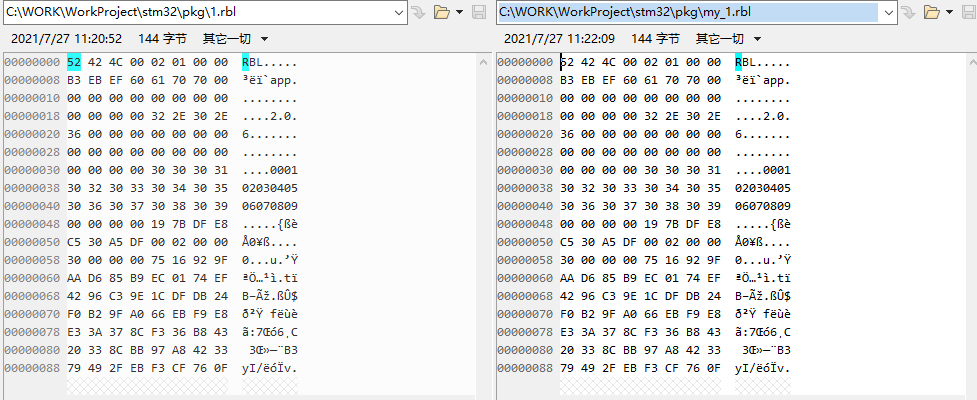

<!--
 * @Author: your name
 * @Date: 2021-07-27 11:24:43
 * @LastEditTime: 2021-07-27 11:32:31
 * @LastEditors: Please set LastEditors
 * @Description: In User Settings Edit
 * @FilePath: \pkg\README.md
-->
# RT-Thread OTA 固件打包器 python版本

RT-Thread OTA 固件打包器原始的固件打包器操作不便，无法在linux上运行，不便于自动打包，自动更新版本。
于是研究了几天，写了一个python的版本，现仅支持gzip压缩,(对我来说足够了。。。quicklz实在太古老。。。)

随便搞了个二进制文件，与原固件打包器的对比如图：
